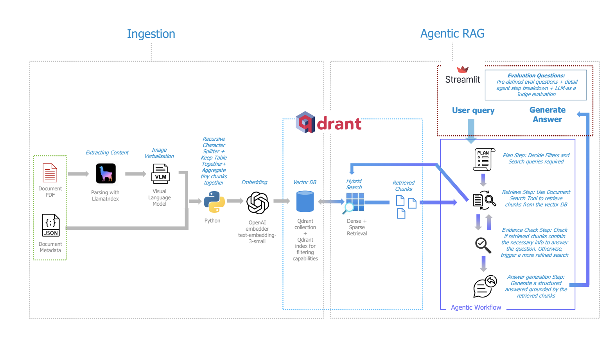

# Agentic RAG Pipeline for Financial Documents

## Setup
### Prerequisites
- **Docker** and **Docker Compose** 
- **OpenAI** API access (chat completion + embeddings).
- **LlamaCloud** API key for PDF parsing (LlamaParse), used during ingestion.

### Environment variables
1. Copy the example file and edit:
  cp .env.example .env

2. Set `OPENAI_API_KEY` and `LLAMA_CLOUD_API_KEY`

### Steps
1. Create .env with `OPENAI_API_KEY` and `LLAMA_CLOUD_API_KEY`.
2. Start Qdrant and the streamlit app: `docker compose up --build -d qdrant app`
3. For the first time, please run the ingestion to index the documents in the database: `docker compose --profile tools run --rm ingest`
4. Open the UI on `http://localhost:8501`

## Project Description
This project implements an Agentic Retrieval-Augmented Generation pipeline for answering questions over PDF documents, in this case financial statements from different companies.

I built it to go beyond a standard RAG setup. In a traditional RAG flow, the system usually embeds the user query, retrieves the top-k chunks, and generates an answer. Here, I implemented a more agentic workflow: the model first plans the retrieval strategy, decides whether company/year/quarter filters are needed, retrieves evidence, checks whether the evidence is sufficient, and only then generates a structured answer. I created a simple streamlit application to allow the user to interact with this agentic system.

This makes the system more flexible for different types of questions, including single-company questions, multi-company comparisons, period-specific financial questions, and broader questions across all indexed companies.

I also created a documents_manifest.json (```src/ingestion/documents_manifest.json```) file to store metadata such as company ticker, company name, year, quarter, and source path. In a production setup, this metadata could come from a SharePoint list, upload form, or enterprise document repository. During retrieval, it is used to apply filters and reduce irrelevant context.





##  Part 1 — Document Processing and Embeddings
### PDF parsing

I used LlamaParse / LlamaCloud with the cost_effective tier and capturred structured outputs such as markdown, text, and page-level items. This gives a good balance between parsing quality and cost, while still exposing useful information such as table items, headers, etc.

I also implemented an optional second-pass VLM path. The idea is to use a local vision model only for pages where parsing is likely to be difficult, especially tables or visually complex layouts or even images. This is disabled by default to keep ingestion simple and reproducible, but it provides a clear extension point for improving table quality.

The trade-off is:

- higher parsing tiers or VLM repair may improve table/image extraction;
- but they increase cost, latency, and operational complexity;


I decided for this parsing approach as by using a parser designed for document understanding is more efficient than building everything from basic PDF libraries such as PyPDF / PyPDF plus extensive custom table-cleaning logic or simple OCR libraries like terrasect.

### Chunking

For normal text (paragraphs), I used a recursive text splitter with chunk size of 1200  and overlap of 100 . This keeps narrative sections reasonably sized while preserving nearby context and where the embedding used, can accurately capture the semantics of these sized chunks.

For tables, I avoid splitting the table itself. Financial tables usually contain semantically connected information: row labels, column headers, units, values, all need to stay together. Splitting a table can break the relationship between these elements / harder to maintain column headers understanding.

The main chunking choices were:

1. Text chunks are split with overlap.
2. Tables are preserved as whole chunks.
3. Small text fragments are merged into a table chunk or larger chunk to avoid indexing useless one-liners.
4. Relevant preceding context / headings can be prepended to table chunks, so the table is not embedded as an isolated grid with no semantic title.

The trade-off is that very large tables may create large chunks, but for this corpus size I prefer preserving table integrity over aggressively splitting numeric evidence.

### Embeddings

I used OpenAI text-embedding-3-small for dense embeddings.

I chose it because it provides a good balance of cost, quality, and latency, and avoids local hardware constraints. Since I am also using OpenAI for the reasoning model, this keeps the stack simpler for a small cost.

## Part 2 — Vector Storage and Retrieval

### Vector database

I used Qdrant as the vector database. Each chunk is stored as one Qdrant point with:

- a dense vector from OpenAI embeddings;
- a sparse vector from FastEmbed BM25;
- metadata such as ticker, company, year, quarter, source file, page number, chunk index.

### Hybrid search

Retrieval uses hybrid search:

- Dense search captures semantic similarity.
- Sparse BM25 search captures exact keyword matches.

This is important for financial documents because exact terms such as “net sales”, “operating income”, “cash equivalents”, “risk factors”, or product segment names can matter a lot. Dense retrieval alone may miss exact table-heavy or terminology-heavy matches.

At query time, the system runs dense and sparse retrieval, then merges them into a final retrieved result using Qdrant’s RRF fusion.

### Metadata filtering

The retrieval tool supports filters for: ticker; year; quarter.

This allows the agent to avoid searching irrelevant documents when the user asks a specific question about a company on a particular year/quarter (E.g., What was Apple’s net sales in Q3 2022?)

For multiple tickers, the tool performs fan-out retrieval: one search per company using limit_per_company, followed by deduplication and sorting. This prevents one company from dominating the global top-k results in comparison questions.

For example, for:

*Which company had the strongest performance among Apple, Microsoft, and Amazon in Q3 2022?*

The system retrieves evidence separately for each company before comparing.

## Part 3 — Response Generation

The response generation is implemented as an agentic workflow using LangGraph.

The workflow is:

Plan → Retrieve → Evidence Check → Follow-up Retrieve → Answer Generation

**Planner Step**:

The planner interprets the user question and decides whether the question is about one company, multiple companies, or all companies, which tickers, years, and quarters should be used as filters and what search query or queries should be sent to the retrieval tool.

**Retrieval**

The retrieval step calls the document search tool, which performs hybrid Qdrant search with the filters defined by the planner step.

**Evidence check**

After retrieval, the agent checks whether the retrieved chunks are sufficient to answer the question. If evidence is missing, the agent can suggest a refined follow-up search. This helps avoid blindly answering from weak or incomplete context.

I capped this step at two retrieval rounds to balance answer quality with latency. For a production chatbot where speed is more important, I would likely reduce or remove the evidence-check loop.

**Final answer**

The final answer is generated only from retrieved chunks by grounding the agent to answer based on the chunks retrieved only. The output is structured JSON and includes:

- answer
- companies covered
- supporting evidence (chunk(s) that led to the answer)
- sources (document from where supporting evidence was retrieved)
- confidence_score (qualitative confidence - low/medium/high )

I use Pydantic models and JSON output formatting to make the outputs parseable and consistent. Lower temperatures can also be used to reduce variation, although some variation is expected because generative models are probabilistic.

## Part 4 — Evaluation

I added an evaluation mode to the Streamlit app.

The evaluation setup includes three curated questions:

- Single-company quantitative question
  - Example: What was Apple’s net sales in Q3 2022?

- Multi-company comparison question
  - Example: Among Apple, Microsoft, and Amazon, which company reported the highest revenue in Q3 2022?

- Global performance question
  - Example: What is the total cost incurred for Intel, Nvidia and Microsoft on year 2023 for all the quarters?

The evaluation flow shows:

Question
→ Retrieval plan
→ Retrieved chunks
→ Evidence check
→ Final answer
→ Expected answer (manually curated)
→ LLM-as-judge score

I use an LLM-as-judge with a fixed rubric:

- factual correctness
- groundedness
- completeness
- retrieved context quality

Each category is scored between 0 and 25, and the final output is a 0–100 score, with the judge LLM providing a reasoning for such scores.

This is not a replacement for a human evaluation set, but it is useful for a small assignment because it makes the evaluation repeatable and visible in the UI. For a development asset, I would complement this with a human-labeled dataset and deterministic checks for numeric metrics. For production, I would add a user feedback option to learn from the erros made.


## Project Strengths

For the context of this assignment, the points below are what I believe to be the strenghts of this implementation:

- *Metadata-optimized retrieval*: I use ticker, year, and quarter metadata to narrow the search space when the question is specific. This improves relevance and avoids retrieving chunks from the wrong company or reporting period.

- *Hybrid retrieval*: I combine dense semantic search with BM25-style sparse retrieval. This is useful for financial documents because some questions rely on meaning, while others depend on exact terms such as “net sales”, “operating income”, “risk factors”, or product segment names.
- *Agentic workflow*: I use a single LangGraph workflow with explicit stages: planning, retrieval, evidence checking, optional follow-up retrieval, and answer generation. This gives the system more flexibility than one-shot RAG while keeping it easier to debug.
- *Multi-company retrieval*: For comparison questions, I run one search per company and then combine the results. This avoids the common issue where one company dominates the top-k retrieved chunks.
- *Structured outputs*: I use Pydantic models and JSON outputs for the retrieval plan, evidence check, final answer, and evaluation results. This makes the system easier to validate, debug, and integrate with downstream applications.
- *Structured Prompts*: Each prompt follow the pattern of role assignment, input to be received, goal, process, critical rules and output specifications.
- *Evaluation and traceability*: The Streamlit app includes an evaluation mode that shows the question, retrieval plan, retrieved chunks, evidence check, final answer, expected answer, and LLM-judge score. This makes the system easier to inspect during a live demo.

## Limitations / Potential Improvements

If I had more time, I would improve the system by:

- PDF table/image extraction is still difficult: Financial PDFs often contain merged cells, footnotes, and multi-page tables and graphs.
- Tables are not always ideal for embeddings: Numeric-heavy table chunks may not be represented as well by dense embeddings as normal narrative text. Hybrid search helps, but it does not fully solve table retrieval.
- Higher latency than basic RAG: The planning, evidence-checking, and optional follow-up retrieval steps improve reliability, but they make the system slower than a simple retrieve-and-answer pipeline.
- LLM-as-judge is only a lightweight evaluation method: It is useful, but it should not replace human review or deterministic checks for numeric answers.
- No reranking layer yet: The system currently relies on hybrid retrieval and RRF fusion. A cross-encoder or LLM reranker could improve the quality of the final context passed to the answer model.
